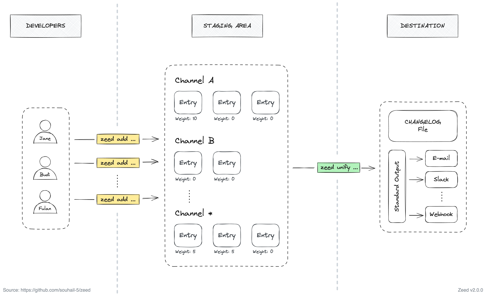

# Zeed
Zeed is a free and open source tool to eliminate changelog-related merge conflicts. Team collaboration and continuous integration will be easier.

**How it works?**
1. Use Zeed to add any entry to your changelog. Zeed will not modify your changelog file, but save your entries as a file within a staging area.
2. When you are ready, ask Zeed to unify all staged entries, and render them according to a template.
3. Finally, use Zeed to delete the staged entries and start over for another release.



## Why Zeed?
Changelog-related merge conflicts can be a significant source of frustration for developers, often discouraging them from maintaining a changelog altogether. Zeed's creation was inspired by these real-life experiences. Similar struggles have been faced even by large teams like GitLab, which [publicly shared their challenges](https://about.gitlab.com/blog/2018/07/03/solving-gitlabs-changelog-conflict-crisis/) with such issues.

## Getting Started

### Download and install
Zeed supports multiple platforms including macOS (Darwin), Windows, and Linux.

To install Zeed, download the appropriate version for your platform from [Zeed Releases](https://github.com/souhail-5/zeed/releases). Once downloaded, the binary can be run from anywhere.

Ideally, you should install Zeed somewhere in your `PATH` for easy use. `/usr/local/bin` is the most probable location.

You can verify your installation by running `zeed --version`.

## Basic usage

- Init Zeed within your project:
  - `zeed init`
- Add entries:
  - `zeed add -t "I am a changelog entry"`
  - `zeed add -t "All changelog entries are saved within <your_project_dir>/.zeed"`
- Unify the entries:
  - `zeed unify`, will output the result
- Delete the entries:
  - `zeed unify --flush`, will output the result and delete the entries

## Advanced usage

The following sections outline advanced usage topics: weights, channels, templates and unifying.

### How to work with weights?
Weights serve to sort the entries:
- Each entry is given a weight.
- The default given weight is `0`.
- Entries are sorted in descending order.

To give a specific weight to an entry, set the `--weight` (or `-w`) option when adding an entry:
- `zeed "I am a changelog entry" --weight 64`.

### How to work with channels?
Channels serve to group the entries:
- Each entry can be attached to a channel.
- By default, entries are not attached to any channel.
- Only channels supported by your project are allowed.

To attach a specific channel to an entry, set the `--channel` (or `-c`) option when adding an entry:
- `zeed "I am a changelog entry" --channel name_of_your_channel`.

#### How to add your own channel?
To add support for a channel in your project, edit `.zeed/.zeed.yaml` file that way:
``` yaml
channels:
  - name_of_your_channel # Only a-z and _ are allowed
```

Channels serve to group the entries, so it will be useful for templates.

Zeed comes with built-in allowed channels that are necessary for built-in templates.

### How to work with templates?
Templates serve to customize the rendering of the unified entries:
- The template used by default is `default`.
- Zeed comes with built-in allowed templates:
  - `default`: one line for each entry
  - `keepachangelog`: compliant with the [keepachangelog.com](https://keepachangelog.com/) format
- Only templates supported by your project are allowed.

To unify the entries with a specific template, set the `--template` (or `-t`) option when unifying the entries:
- `zeed unify --template name_of_the_template`.

#### How to add your own template?
Templates must use [Go templating engine](https://golang.org/pkg/text/template/). They have access to these data :
- `Entries`: list of all entries. Each entry include these fields:
  - `Text`: entry's text
  - `FrontMatter`: entry's metadata
    - `Channel`: entry's channel
    - `Weight`: entry's weight
- `Channels`: list of all entries grouped by channel name

To add your own template, edit `.zeed/.zeed.yaml` file that way:
``` yaml
templates:
  default: "{{range .Entries}}• {{.Text}}\n{{end}}" # overrides the built-in "default" template
  slack: |-
    *What's new?*
    {{range .Entries -}}
    - {{.Text}}
    {{end}}
  name_of_the_template: |
    {{range .Entries -}}
    {{- if eq .FrontMatter.Channel "" -}}
    - {{.Text}} ({{.FrontMatter.Weight}})
    {{- end}}
    {{- if eq .FrontMatter.Channel "added" -}}
    - [Added] {{.Text}} ({{.FrontMatter.Weight}})
    {{- end}}
    {{end -}}
```

### How to update your changelog file?
When unifying your entries, you have the option to directly place them in your changelog file at a specific location using the `--aline` (or `-a`) and/or `--bline` (or `-b`) options. Be sure to carefully escape the values of these options, as they form part of the built-in Zeed regular expressions that are used to find and insert the unified entries at the correct position within the changelog file.

Examples:
- `zeed unify --aline "## Unreleased"` unifies your entries, then adds them on a new line after the first line containing "## Unreleased".
- `zeed unify --bline "## Version "` unifies your entries, then adds them on a new line before the first line containing "## Version ".
- `zeed unify --aline "## Unreleased" --bline "## "` unifies your entries, then replaces text between the line containing "## Unreleased" and the following line containing "## ".

## Contributing

Please read [CONTRIBUTING.md](CONTRIBUTING.md) for details on our code of conduct, and the process for submitting pull requests to us.

## Versioning

We use [SemVer](http://semver.org/) for versioning.

## Maintainers

* **Souhail** - [Profile](https://github.com/souhail-5/)

See also the list of [contributors](https://github.com/souhail-5/zeed/graphs/contributors) who participated in this project.

## License

This project is licensed under the MIT License - see the [LICENSE](LICENSE) file for details.